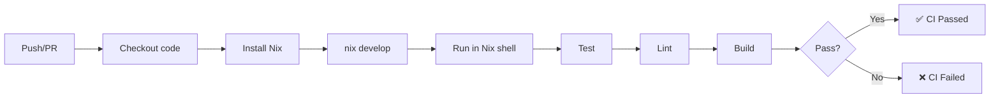

# Terraform Module Version Management Tool

A production-ready Go CLI tool that automatically discovers, analyzes, and updates Terraform module versions to the latest available from registries.

## Features

- **Module Discovery** - Recursively finds all Terraform module invocations in a directory tree
- **Version Analysis** - Determines current and latest available versions using semantic versioning
- **Safe Updates** - Atomic file writes with format preservation (comments, indentation intact)
- **Parallel Processing** - Fast registry queries using goroutine worker pool
- **Extensible Architecture** - Easy to add support for new registry types
- **Two Command Modes**:
  - `show` - Display available updates without modifying files
  - `update` - Automatically apply all updates

## Quick Start

### Installation

#### Option 1: Nix (Recommended)
Install directly from the flake without cloning:
```bash
nix run github:vdesjardins/terraform-module-versions -- show ./terraform
```

Or install into your profile:
```bash
nix profile install github:vdesjardins/terraform-module-versions
tf-update-module-versions show ./terraform
```

#### Option 2: Build from Source
Prerequisites:
- Go 1.25+ (or use provided Nix development environment)
- make

Build:
```bash
make build
```

This creates a static binary at `bin/tf-update-module-versions` (~12MB).

### Usage

#### Show Available Updates
```bash
./bin/tf-update-module-versions show ./terraform
```

Shows a formatted table of all modules with available updates:
```
╔════════════════════════════════════════════════════════════╗
║  Terraform Module Update Summary                           ║
╚════════════════════════════════════════════════════════════╝

✓ hashicorp/vault-starter/aws (Terraform Registry)
  Current Versions:  0.1.3 (1)
  Latest Version:    1.0.0
  Modules to Update: 1
  Status:            UPDATE AVAILABLE
```

#### Apply Updates
```bash
./bin/tf-update-module-versions update ./terraform
```

Automatically updates all module versions in `.tf` files to the latest available.

### Development

#### Setup Development Environment

Using Nix (recommended):
```bash
direnv allow  # Auto-loads Go, linter, make, etc.
```

Or manually ensure you have:
- Go 1.25+
- golangci-lint (for linting)
- make

#### Common Commands

```bash
make build    # Build the binary
make test     # Run all unit tests (25+ tests)
make fmt      # Format code
make lint     # Lint code (requires golangci-lint)
make clean    # Remove build artifacts
make help     # Show all targets
```

## Architecture

### Package Structure

```
internal/
├── version/       - Semantic version comparison and sorting
├── finder/        - Recursive Terraform module discovery
├── source/        - Extensible source type system
├── registry/      - Parallel version fetching from registries
├── updater/       - Atomic file updates with format preservation
└── report/        - Summary reporting and console output

cmd/tf-update-module-versions/
├── cmd/
│   ├── root.go    - Cobra CLI framework setup
│   ├── show.go    - Show command implementation
│   └── update.go  - Update command implementation
└── main.go        - Entry point with version info
```

### Key Components

#### Version Module (`internal/version/`)
- Semantic version comparison using industry-standard semver
- Sorts versions with latest-first ordering
- Handles pre-releases and build metadata

#### Finder Module (`internal/finder/`)
- Recursively scans directories for `.tf` files
- Parses Terraform configuration to extract module invocations
- Filters to only explicit version specifications
- Returns structured module metadata

#### Source System (`internal/source/`)
- **Extensible architecture** - Adding new registry types requires implementing `SourceHandler` interface
- **Terraform Registry** - `hashicorp/vault-starter/aws` format
- **Custom Registries** - `custom.host.com/namespace/name/provider` format
- **Future support** - GitHub, GitLab (framework ready)

#### Registry Client (`internal/registry/`)
- Queries Terraform Registry HTTP API
- Parallel version fetching with configurable worker pool (default: 4 workers)
- 30-second timeout for stability
- Automatic version sorting and filtering

#### Updater Module (`internal/updater/`)
- Regex-based module version replacement
- **Atomic writes** - Uses temporary file + fsync + rename to prevent corruption
- Format preservation - Maintains comments, indentation, other formatting
- Comprehensive error handling

#### Report Module (`internal/report/`)
- Aggregates update findings
- Generates formatted console output with colors
- Provides detailed statistics on changes
- Supports summary reporting for unsupported sources

## Supported Module Sources

| Source | Status | Example |
|--------|--------|---------|
| Terraform Registry | ✅ Fully Supported | `hashicorp/vault-starter/aws` |
| Custom Registries | ✅ Fully Supported | `registry.example.com/org/name/provider` |
| GitHub | ⚠️ Not Yet Implemented | Framework ready |
| GitLab | ⚠️ Not Yet Implemented | Framework ready |

Adding new sources is straightforward - see `internal/source/handlers.go` for the pattern.

## Testing

The project includes comprehensive unit tests:

```bash
make test
```

**Test Coverage:**
- `internal/version/` - 11 tests (comparator, sorting, edge cases)
- `internal/source/` - 12 tests (parsing, resolution, edge cases)
- `internal/finder/` - 2 tests (discovery, filtering)
- `internal/registry/` - 3 tests (API client, fetching)
- `internal/updater/` - 3 tests (file updates, formatting)

**Integration Tests:**
- Real registry queries to `registry.terraform.io`
- End-to-end module discovery and update workflow
- File update verification with format preservation

All tests use realistic fixtures in `tests/fixtures/`.

## Configuration

Currently configuration is minimal - all options are via CLI arguments:

```bash
./bin/tf-update-module-versions show [path]
./bin/tf-update-module-versions update [path]
```

Future enhancements could include:
- `.tfversionrc` configuration file
- CLI flags for dry-run, JSON output, worker count
- Version constraint policies (e.g., only patch updates)

## Performance

- **Startup**: ~100ms (binary load + initial parsing)
- **Discovery**: ~500ms for typical project (100+ modules)
- **Registry Queries**: Parallelized - 1 second for 20 modules with 4 workers
- **Updates**: ~50ms per file

The registry client uses a worker pool pattern with 4 goroutines by default, balancing speed against API load.

## Future Enhancements

### Immediate (Low Effort)
- [ ] CLI flags: `--dry-run`, `--json`, `--verbose`, `--workers N`
- [ ] Configuration file support (`.tfversionrc`)
- [ ] Better error messages and diagnostics

### Medium Complexity
- [ ] GitHub releases as version source
- [ ] GitLab package registry support
- [ ] Version constraint patterns (`~1.0`, `^2.0`, `>=1.5`)
- [ ] Module filtering and include/exclude patterns

### Advanced
- [ ] CI/CD integration (GitHub Actions, GitLab CI)
- [ ] Auto-PR generation for updates
- [ ] Change tracking and rollback capability
- [ ] Registry result caching with TTL

## Building from Source

### Standard Build
```bash
go build -o bin/tf-update-module-versions ./cmd/tf-update-module-versions
```

### Release Build (with version info)
```bash
go build \
  -ldflags "-X main.Version=$(git rev-parse --short HEAD) -X main.Commit=$(git rev-parse HEAD) -X main.BuildTime=$(date -u +'%Y-%m-%dT%H:%M:%SZ')" \
  -o bin/tf-update-module-versions \
  ./cmd/tf-update-module-versions
```

### Static Binary
```bash
CGO_ENABLED=0 go build -o bin/tf-update-module-versions ./cmd/tf-update-module-versions
```

The default Makefile build creates a static binary.

## Example Workflow

```bash
# 1. Build the tool
make build

# 2. Check what would be updated in your Terraform code
./bin/tf-update-module-versions show ./terraform

# 3. Review the output to see what versions would change
# Output shows current vs latest for each module

# 4. Apply the updates
./bin/tf-update-module-versions update ./terraform

# 5. Verify changes (git diff shows what changed)
git diff terraform/

# 6. Commit and push
git add terraform/
git commit -m "chore: update terraform module versions"
git push
```

## Troubleshooting

### Binary not found after build
```bash
make clean && make build
```

### Tests failing
```bash
# Run with verbose output
go test -v ./...

# Run specific test
go test -v -run TestComparatorCompare ./internal/version
```

### Module not discovered
- Ensure module uses explicit `version` argument in `source` block
- Check `.tf` file is in scanned directory (recursive)
- Verify module source format matches known types

### Registry query timeout
- Increase timeout in `internal/registry/client.go` (currently 30s)
- Check network connectivity to `registry.terraform.io`
- Reduce number of modules or run during off-peak hours

## Development Notes

### Code Organization
- Each package is self-contained with clear responsibilities
- Interfaces used for extensibility (e.g., `SourceHandler`)
- Error handling is explicit and comprehensive
- Tests are co-located with implementation (`*_test.go`)

### Dependencies
- `github.com/spf13/cobra` - CLI framework
- `github.com/Masterminds/semver/v3` - Semantic versioning
- Go standard library - Everything else

### Adding a New Registry Type
1. Implement `SourceHandler` interface in `internal/source/handlers.go`
2. Add pattern matching in resolver
3. Write unit tests
4. Update documentation

See the Terraform Registry handler for a concrete example.

## Release Process

This project uses **GoReleaser** for automated releases with multi-platform binary builds, changelog generation, and GitHub release management.

### Creating a Release

1. **Ensure commits follow Conventional Commits format**:
   - `feat:` for features
   - `fix:` for bug fixes
   - `docs:` for documentation
   - `refactor:` for code improvements
   - `chore:`, `ci:`, `test:` for maintenance

2. **Create a semantic version tag**:
   ```bash
   git tag -a v1.2.3 -m "Release v1.2.3"
   git push origin v1.2.3
   ```

3. **GitHub Actions automatically**:
   - Builds binaries for Linux (amd64, arm64), macOS (amd64, arm64), Windows (amd64)
   - Generates checksums and creates archives (tar.gz for Unix, zip for Windows)
   - Creates a **draft release** on GitHub (requires manual promotion)
   - Generates changelog from conventional commits

### Draft Releases

- Releases are created as **drafts** on GitHub
- Review the generated changelog and binary assets
- Click "Publish release" when ready

### Release Artifacts

Each release includes:
- ✅ Compiled binaries for all platforms
- ✅ SHA256 checksums (`checksums.txt`)
- ✅ Source code archives (zip/tar.gz)
- ✅ Auto-generated changelog from commit history
- ✅ Installation instructions

### Installation from Release

**Download specific version**:
```bash
VERSION=v1.2.3
wget https://github.com/vdesjardins/tf-update-module-versions/releases/download/$VERSION/tf-update-module-versions_Linux_x86_64.tar.gz
tar xzf tf-update-module-versions_Linux_x86_64.tar.gz
sudo mv tf-update-module-versions /usr/local/bin/
```

**Verify checksums**:
```bash
sha256sum -c checksums.txt
```

### Configuration Files

- `.goreleaser.yaml` - GoReleaser configuration for builds and release management
- `.github/workflows/release.yml` - GitHub Actions workflow triggered on version tags
- `.github/workflows/conventional-commits.yml` - PR title validation for semantic commits

## CI/CD Pipeline

[](https://github.com/vdesjardins/tf-update-module-versions/actions/workflows/ci.yml)

This project includes a comprehensive CI/CD pipeline to ensure code quality and reliability.

### Nix-Based CI Approach

The CI pipeline uses **Nix for dependency management** instead of individual GitHub Actions, ensuring consistency between local development and CI/CD environments:

- ✅ **Single Source of Truth**: All dependencies defined in `flake.nix`
- ✅ **Environment Consistency**: Local dev environment = GitHub Actions CI
- ✅ **Simplified Workflow**: Let Nix handle Go, golangci-lint, and tool versions
- ✅ **Automatic Caching**: Nix manages build caching efficiently
- ✅ **Cleaner Configuration**: Fewer workflow actions, more readable

### Automated Checks

Every push to `main`/`develop` and every pull request automatically triggers a single CI job that runs:

1. **Test Suite** - Runs all unit tests with coverage
   ```bash
   go test -v -race -coverprofile=coverage.out ./...
   ```
   - Full race condition detection
   - Code coverage reporting
   - Coverage uploaded to Codecov

2. **Lint Check** - Validates code style and quality
   ```bash
   golangci-lint run ./...
   ```
   - Enforces project code standards
   - Issues reported as PR annotations

3. **Build Verification** - Confirms binary compilation
   ```bash
   make build
   ```
   - Verifies binary builds successfully
   - Binary artifact preserved for inspection (5 days)

All three checks run sequentially in the same Nix shell environment (~12-15 minutes total).

### Workflow Files

- `.github/workflows/ci.yml` - Main CI pipeline (test, lint, build with Nix)
- `.github/workflows/release.yml` - Release workflow (on version tags)
- `.github/workflows/conventional-commits.yml` - Commit validation

### Branch Protection

The `main` branch has protection rules requiring:
- ✅ All CI checks must pass
- ✅ PR review approval
- ✅ Up-to-date with main branch
- ✅ Conventional commit compliance

### Performance

- **Unified Execution**: All checks in single Nix shell (~12-15 minutes total)
- **Nix Caching**: Automatic caching of build artifacts and dependencies
- **Artifacts**: Binary preserved for 5 days for inspection and verification

### How the CI Works



### Local CI Testing

To test the workflow locally before pushing, simply run:

```bash
# Enter Nix development environment
nix develop

# Run all checks (same as CI)
make test
make lint
make build
```

Or run all at once:
```bash
nix develop --command bash -c 'make test && make lint && make build'
```

### Workflow Status

Check the status of all workflows: https://github.com/vdesjardins/tf-update-module-versions/actions

## License

This project was developed as an experiment in Terraform tooling automation.

## References

- [Terraform Registry API](https://www.terraform.io/cloud-docs/api-docs/modules)
- [Semantic Versioning](https://semver.org/)
- [Cobra CLI Framework](https://cobra.dev/)
- [Terraform Module Documentation](https://www.terraform.io/language/modules)
